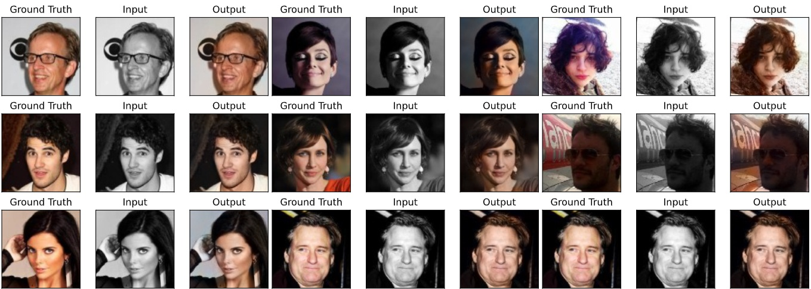
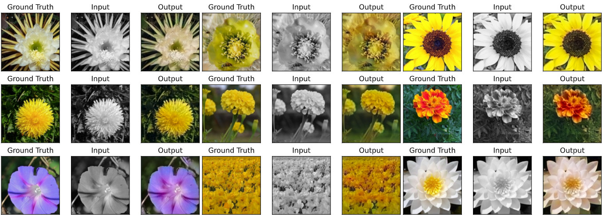

# TensorFlow Implementation and analysis of Image Colorization

## Introduction
I have implemented the CNN based image colorization technique as suggested by Satoshi, Edgar and Hiroshi in their 2016 Paper named as “Let there be Color! : Joint End-to-end Learning of Global and Local Image Priors for Automatic Image Colorization with Simultaneous Classification [[1]](#1) (Satoshi Iizuka, 2016)”. I have tried to analyze its result on various datasets.

## Architecture
I have used the same model architecture as suggested in the original paper with a Low-Level features extraction layer whose output is send to Mid-Level feature extraction and Global feature extraction outputs from both are than fused together in a fusion layer and then sent for deconvolution(In original paper it Up Sampling layer was used but I have used 2D deconvolution.).

## Datasets
### 1.	CelebA dataset(Large-Scale Celeb Faces Attributes Dataset (Liu, 2015) [[2]](#2) )
Dataset Contains more than 200k images of celebrity faces from different countries. I used 1000 images from them as training data 200 as validation data and 200 as test data.
### 2.	Linnaeus 5 dataset (Chaladze, 2017) [[3]](#3)
Dataset contains two parts Test and Train, Train contains 6000 classes divide equally between 5 classes and Test contains 2000 images divided equally among 5 classes. I used images of ‘flower’ class from the dataset because they were more colorful and thus giving model more colors to learn

## Outputs
### On CelebA Dataset (Input Images resized to 100 X 100)

### On Linnaeus Dataset (Input Image 256 X 256)

## References
<a id="1">[1]</a> 
Satoshi Iizuka, Edgar Simo-Serra, and Hiroshi Ishikawa.
"Let there be Color!: Joint End-to-end Learning of Global and Local Image Priors for Automatic Image Colorization with Simultaneous Classification".
ACM Transaction on Graphics (Proc. of SIGGRAPH), 35(4):110, 2016. [link](http://iizuka.cs.tsukuba.ac.jp/projects/colorization/data/colorization_sig2016.pdf)

<a id="2">[2]</a> 
 Ziwei Liu, Ping Luo, Xiaogang Wang, and Xiaoou Tang. Deep learning face attributes in thewild.  InProceedings of International Conference on Computer Vision (ICCV), December2015. [Link](http://mmlab.ie.cuhk.edu.hk/projects/CelebA.html)

<a id="3">[3]</a> 
Chaladze, G. Kalatozishvili L. 2017. Linnaeus 5 Dataset for Machine Learning [Link](http://chaladze.com/l5/)
